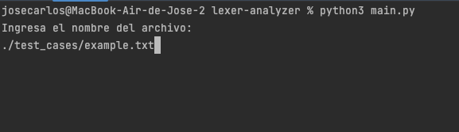
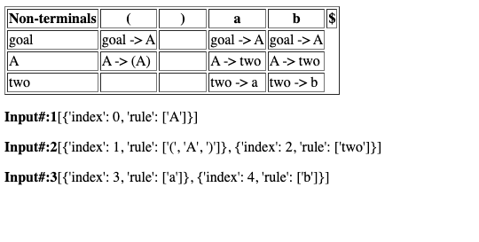

<div id="top"></div>


[![MIT License][license-shield]][license-url]


<!-- PROJECT LOGO -->
<br />
<div align="center">
  <a href="https://github.com/othneildrew/Best-README-Template">
    
  </a>
  <h3 align="center">First and Follow</h3>
  <p align="center">Proyecto de Compiladores Parte 3</p>
<p>Jose Carlos Pacheco Sanchez - A01702828</p>
</div>


<!-- USAGE EXAMPLES -->
## Manual de uso


> Nota: Si ya tienes Python 3.9 o superior puedes omitir la instalación, puedes verificarlo con el comando

```
Python3 --version
```
### Instalación

- Ubica el archivo "setup.sh" en tu terminal
- Asegurate de que el archivo tenga permisos de ejecución, para esto puedes usar el comando:
```
ls -la
```
- Si el archivo setup.sh NO tiene permisos de ejecución puedes agregaselo con el comando:

```
chmod +x setup.sh
```
o en su defecto
```
chmod 777 setup.sh
```

- Una vez tu archivo setup.sh tenga los permisos ejecutalo y deberas ingresar tu contraseña para que descargue todos los paquetes:

```
./ setup.sh
```

- Una vez que termine de instalarse se ejecutara de forma inmediatamente el programa "main.py" el cual corresponde al proyecto, podras ver en tu terminal algo parecido:


### Usándolo

- De forma imediata el programa te pedira que ingrese el nombre de un archivo por lo que veras en tu terminal algo parecido:
<div align="center">
    
</div>
<p align="right">(<a href="#top">back to top</a>)</p>

- Deberas ingresar el nombre del archivo o en su defecto usar los test cases ubicados en ./test_Cases/


>Nota: Si asi lo deseas puedes poner los archivos al nivel del main o en su defecto en la carpeta de test_cases

- Ejemplo de entrada:
<div align="center">
    
</div>

- El resultado sera parecido al siguiente:
<div align="center">
    
</div>

>Nota: El archivo de HTML lo podras encontrar en la carpeta de test_cases con el nombre: fecha_hoy-Table.html

- Ejemplo de la tabla:
<div align="center">
    
</div>


<!-- MARKDOWN LINKS & IMAGES -->
<!-- https://www.markdownguide.org/basic-syntax/#reference-style-links -->
[license-shield]: https://img.shields.io/github/license/othneildrew/Best-README-Template.svg?style=for-the-badge
[license-url]: https://github.com/JoseCarlosPa/lexer-analyzer/blob/main/LICENCE.md
