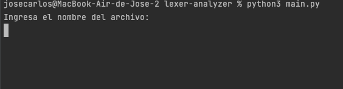
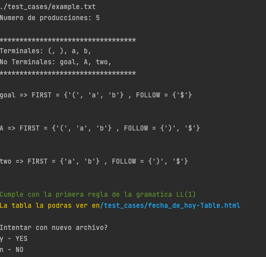

<div id="top"></div>


[![MIT License][license-shield]][license-url]


<!-- PROJECT LOGO -->
<br />
<div align="center">
  <a href="https://github.com/othneildrew/Best-README-Template">
    
  </a>
  <h3 align="center">Lexer Analyzer</h3>
  <p align="center">Proyecto de Compiladores Parte 1</p>
<p>Jose Carlos Pacheco Sanchez - A01702828</p>
</div>


<!-- USAGE EXAMPLES -->
## Manual de uso


> Nota: Si ya tienes Python 3.9 o superior puedes omitir la instalación, puedes verificarlo con el comando

```
Python3 --version
```
### Instalación

- Ubica el archivo "setup.sh" en tu terminal
- Asegurate de que el archivo tenga permisos de ejecución, para esto puedes usar el comando:
```
ls -la
```
- Si el archivo setup.sh NO tiene permisos de ejecución puedes agregaselo con el comando:

```
chmod +x setup.sh
```
o en su defecto
```
chmod 777 setup.sh
```

- Una vez tu archivo setup.sh tenga los permisos ejecutalo y deberas ingresar tu contraseña para que descargue todos los paquetes:

```
./ setup.sh
```

- Una vez que termine de instalarse se ejecutara de forma inmediatamente el programa "main.py" el cual corresponde al proyecto, podras ver en tu terminal algo parecido:
<div align="center">
    
</div>
<p align="right">(<a href="#top">back to top</a>)</p>


### Usándolo

- El menu consta de 3 secciones y podran ser elegidos unicamente con los numeros 1,2 o 3:
  <ol>
    <li>Seleccionar un archivo</li>
    <li>Correr pruebas de "test_cases"</li>
    <li>Salir</li>
  </ol>
- En la primera opción correspondiente al número "1" podras leer el contenido de un archivo especificando su nombre o el path del archivo incluyendo su extension (.txt), veras una pantalla parecida a esta:
<div align="center">
    
    [Pantalla de menu para ingresar nombre de archivo]
</div>
<div align="center">
    
    [Pantalla con el resultado del analizador lexico en consola ]
</div>

>Nota: Si se desea puedes copiar y pegar tu archivo al mismo nivel que el archivo main.py para solo escribir el nombre del archivo
- En la opcion correspondiente al número "2" puedes utilizar los test cases que se proporcionan y en este caso solo será necesario escribir el nombre del archivo con su extension (.txt)
<div align="center">
    
    [Pantalla del menu con la lista de inputID.txt ]
</div>
<div align="center">
    
    [Pantalla del resultado del analizador lexico en consola ]
</div>

>Nota: Si se desea puedes copiar y pegar tus archivos en la carpeta "test_cases" y escribir el nombre con su extension (.txt)


<!-- MARKDOWN LINKS & IMAGES -->
<!-- https://www.markdownguide.org/basic-syntax/#reference-style-links -->
[license-shield]: https://img.shields.io/github/license/othneildrew/Best-README-Template.svg?style=for-the-badge
[license-url]: https://github.com/JoseCarlosPa/lexer-analyzer/blob/main/LICENCE.md
